## BorgPilot - It is a user interface for controlling and operating the BorgBackup program.
BorgPilot is a project that evolved from my operational needs to control and operate &copy;BorgBackup,
providing a clean and simple interface based on standard Qt widgets.

Borgbackup, AKA: borg, is a fantastic professional backup program, very reliable and stable, which I've been using for years.
Although borgbackup is very simple to use on the command line and easily integrates with bash scripts, I thought it would be a great exercise to create a graphical interface for it.
The basic idea is to allow the main tasks to be performed without the operator having to spend a lot of time on the command line and with scripts.

BorgPilot performs the following tasks:

- Allows the initialization of local and remote repositories (passwordless SSH remote connection keys must be correctly configured)
- Allows the creation of backups. Through the interface, the user can define the backup characteristics, such as: source files, common options, and optional options, and their values.
- Allows for controlled execution of generated backup scripts.
- List and Search: Allows for listing the contents of the repositories in a simple manner, allowing the use of standard borgbackup patterns.
- Utilities: Allows the execution of the commands: info, list, check, diff, rename, delete, and prune, displaying the results in the interface and allowing
the results to be saved to files. - BorgBackup Settings: Directories and Files, General, and Automatic Responses.
- Graphics: Visualization of backup storage consumption. Shows a bar graph with the Y-axis representing available (free) space and the X-axis showing bars with the original backup value and the actual deduplicated value.
For repository initialization and backup functions, BorgPilot will generate a bash script for the operator to perform.
You can make changes to the generated script if necessary. For examples, see src/doc/scripts-sample.
- Dashboard: The dashboard module centralizes telemetry and visualization of data from active repositories.

### Build Requirements
- C++20 or later
- Qt 6.11 or later

### Development Environment:
Tested on:
- Fedora 42 or later
- clang 21.1.8
- (GCC) 15.2.1
- cmake version 3.31.x
- QtCreator 19.0.x (clang-format Mozilla style)

### Documentation
Run Doxygen in `src/` to generate HTML docs in `src/doc/html`.

## Screenshots
### Main Window
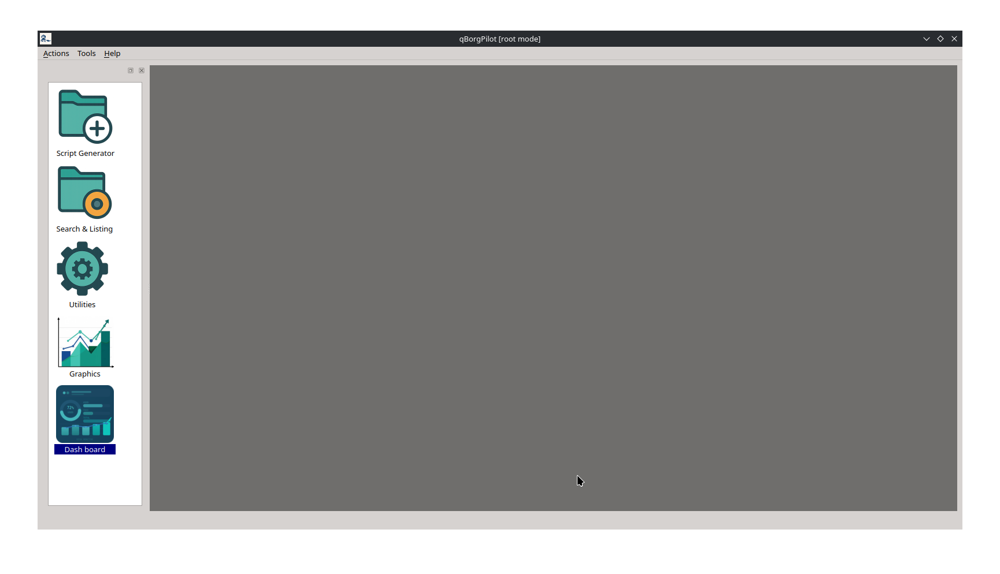
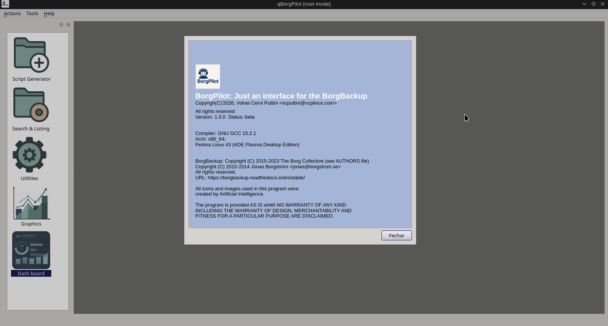

### Modules

#### Dashboard
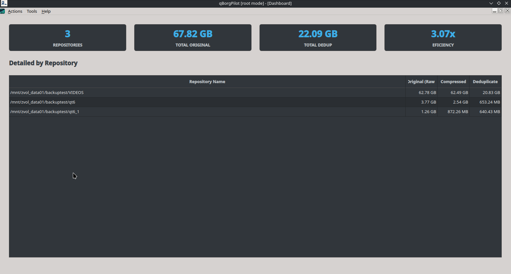

#### Initialization & Creation Repositories
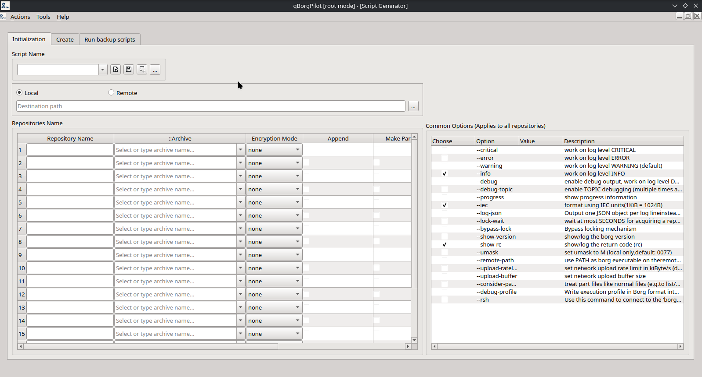
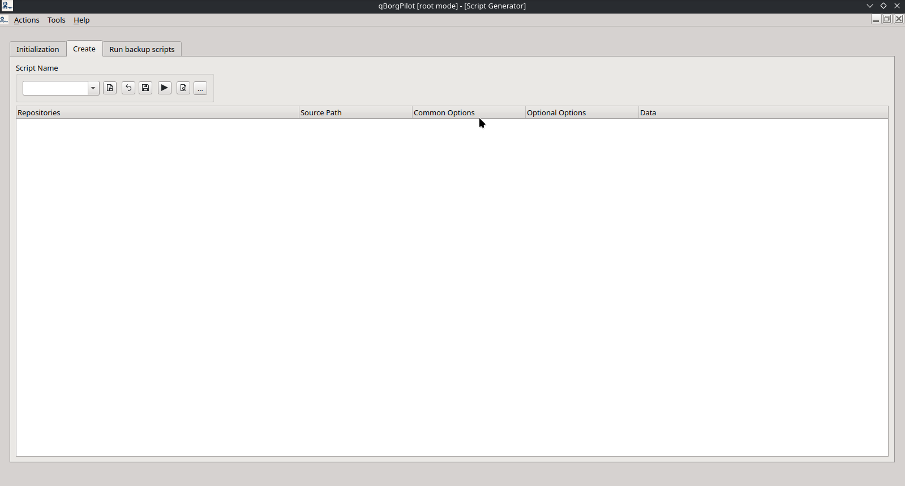
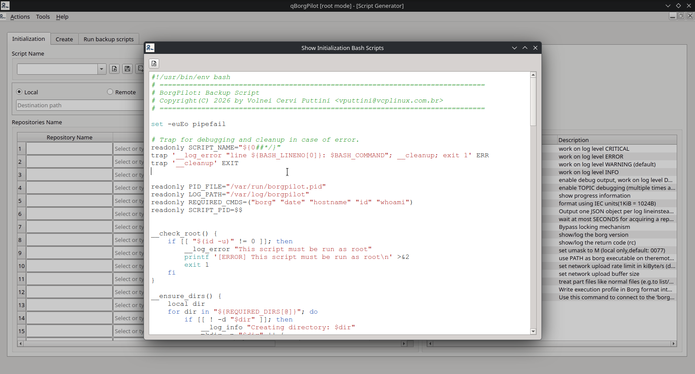
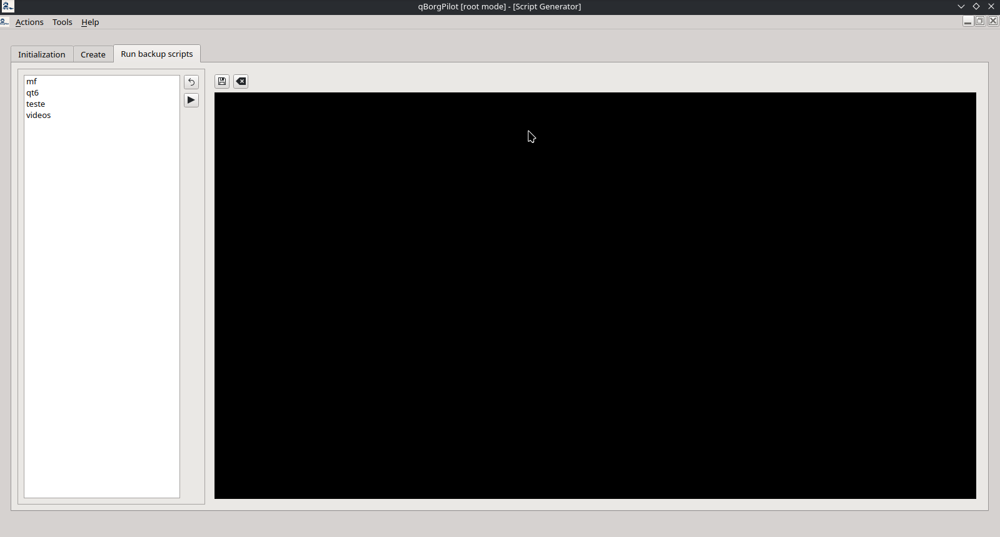

#### Search & Listing
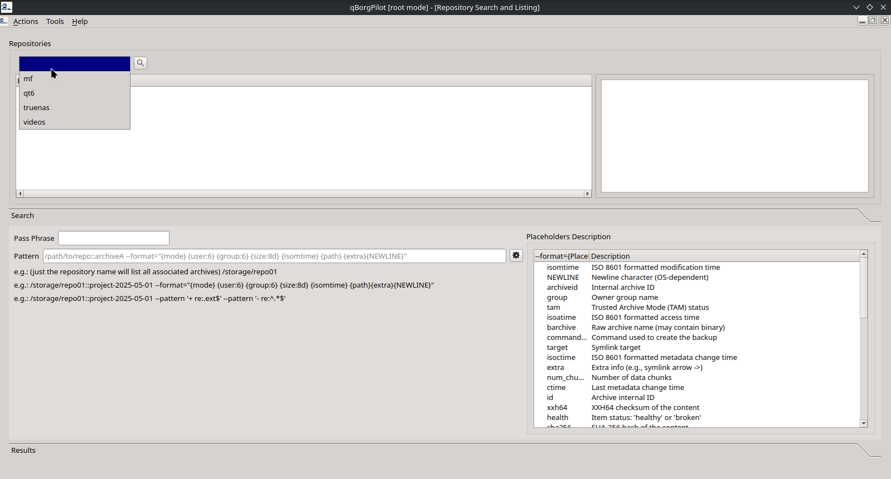

#### Utilities
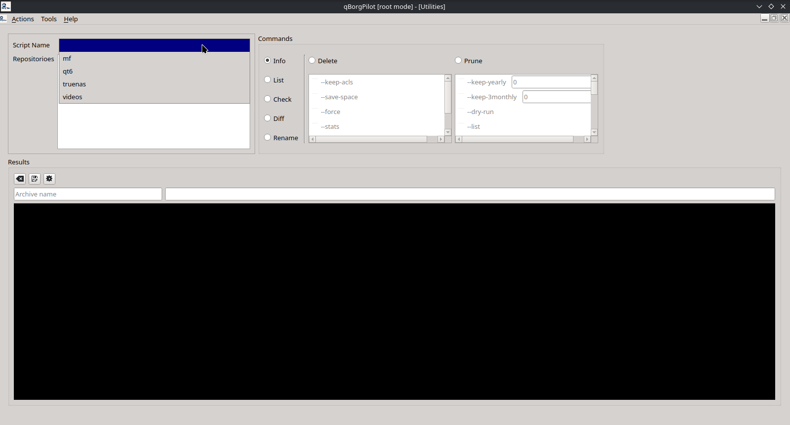

#### Graphics
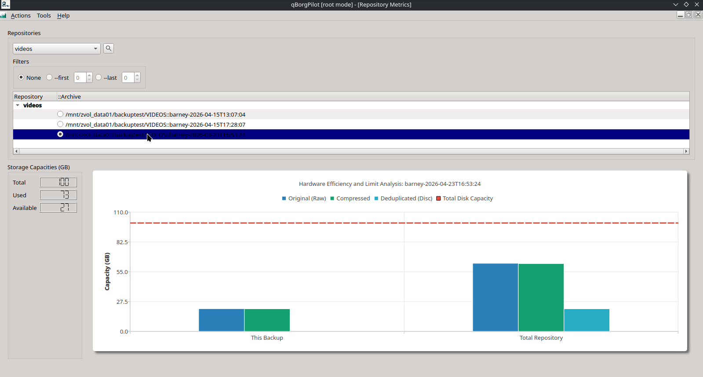

#### Settings
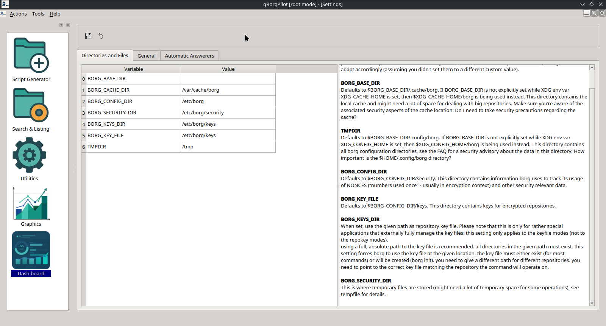
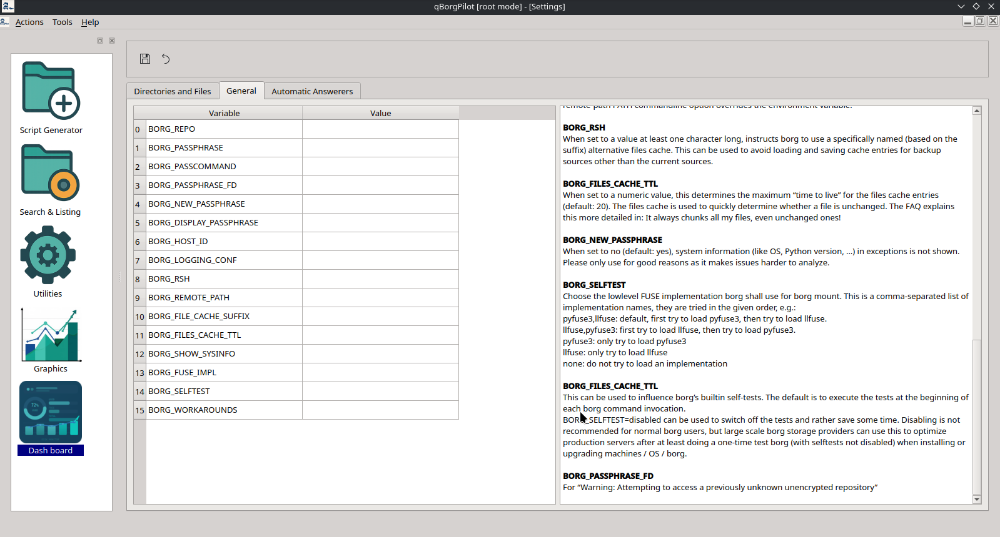
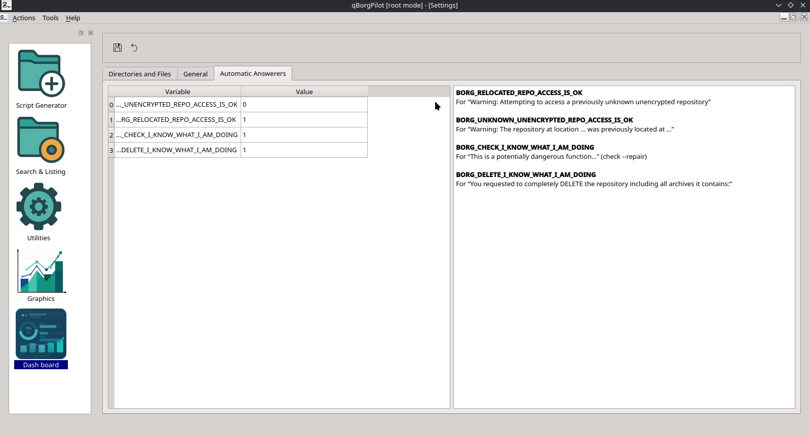

## Legal

- BorgBackup: Copyright (C) 2015-2023 The Borg Collective; (C) 2010-2014 Jonas Borgström. 
  - [License](https://borgbackup.readthedocs.io/en/stable/authors.html#license)
  - [BorgBackup Docs](https://borgbackup.readthedocs.io/en/stable/)
- Linux®: Trademark of Linus Torvalds.
- Qt®: Trademark of The Qt Company.
- Other brands belong to their owners.

