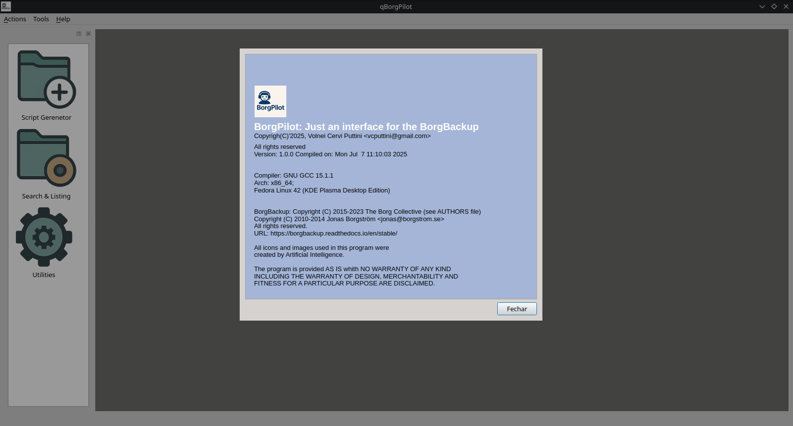
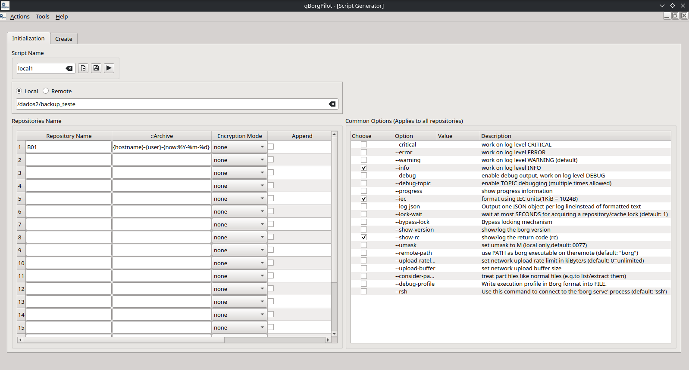
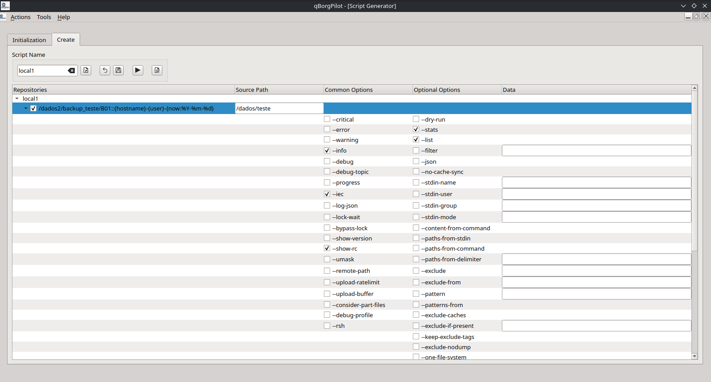

## BorgPilot - Is a user interface for the BorgBackup program
This software aims to provide a control interface for &copy;[BorgBackup][1].

Borgbackup, AKA: borg, is a fantastic professional backup program, very reliable and stable, which I've been using for years.
Although borgbackup is very simple to use on the command line and easily integrates with bash scripts, I thought it would be a great exercise to create a graphical interface for it.
The basic idea is to allow the main tasks to be performed without the operator having to spend a lot of time on the command line and with scripts.

BorgPilot performs the following tasks:

- Allows the initialization of local and remote repositories (passwordless SSH remote connection keys must be correctly configured)
- Allows the creation of backups. Through the interface, the user can define the backup characteristics, such as: source files, common options, and optional options, and their values.
- List and Search: Allows for listing the contents of the repositories in a simple manner, allowing the use of standard borgbackup patterns.
- Utilities: Allows the execution of the commands: info, list, check, diff, rename, delete, and prune, displaying the results in the interface and allowing
the results to be saved to files. - BorgBackup Settings: Directories and Files, General, and Automatic Responses.

For repository initialization and backup functions, BorgPilot will generate a bash script for the operator to perform.
You can make changes to the generated script if necessary. For examples, see src/doc/scripts-sample.

### Dependencies for Compilation:
- At least C++20
- At least Qt Framework 6.6.x

### My Environment
- Fedora 42
- clang 20.1.7
- (GCC) 15.1.1 20250521 (Red Hat 15.1.1-2)
- cmake version 3.31.x
- QtCreator 17.0.x (Code Style: clang-format -style=Mozilla)

### General Documentation of the Code Generated by Doxygen
To generate source code documentation, access the src directory and run the doxygen command. The documentation will be created in the src/doc/html directory.

## Screenshots
### Main Window

### Modules

#### Initialization & Creation Repositories

#### Search & Listing

#### Utilities

#### Settings

#### Tools

### Legal Informations
- BorgBackup is:
    - Copyright (C) 2015-2023 The Borg Collective (see [AUTHORS](https://borgbackup.readthedocs.io/en/stable/authors.html) file)
    - Copyright (C) 2010-2014 Jonas Borgström <jonas@borgstrom.se> All rights reserved.
- Linux&reg; is registered trademark of Linus Torvalds.
- Qt&reg; is registered trademark of Qt Company.
- Any other brand referenced by us belongs to their respectives owners.

[1]: https://borgbackup.readthedocs.io/en/stable/
